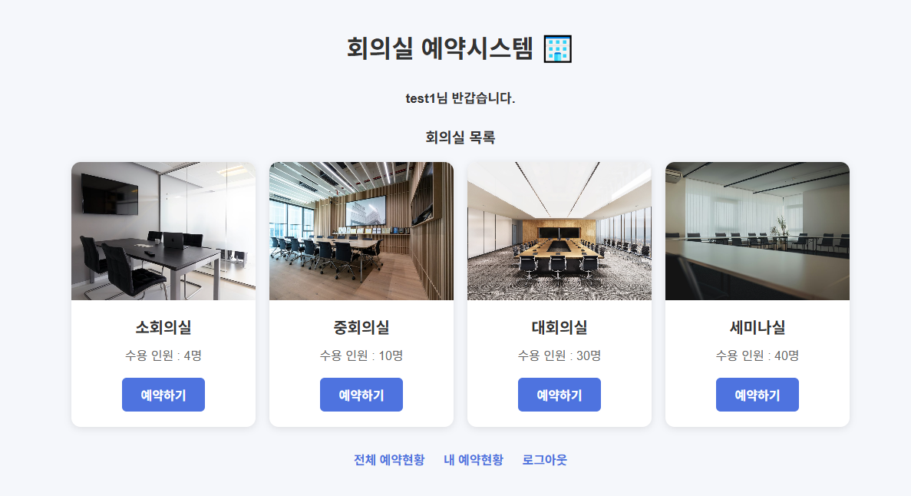
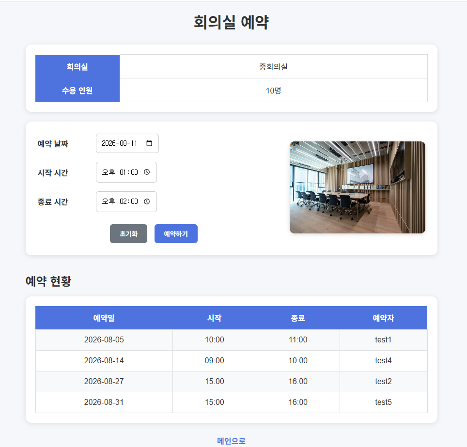
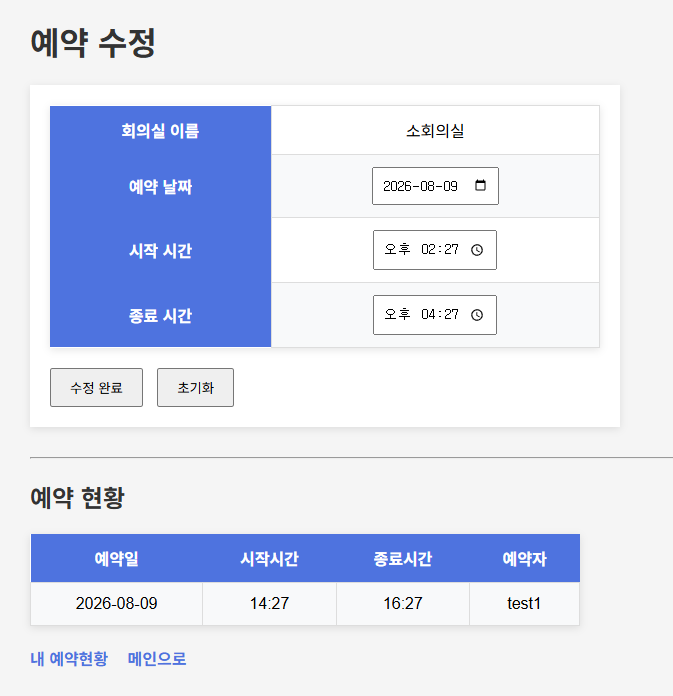
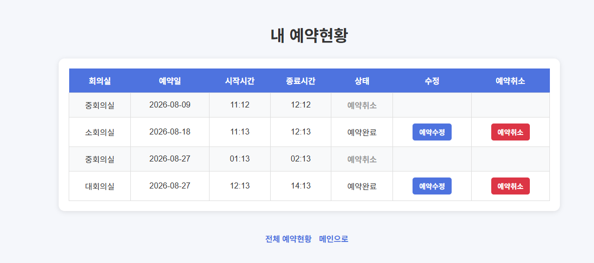
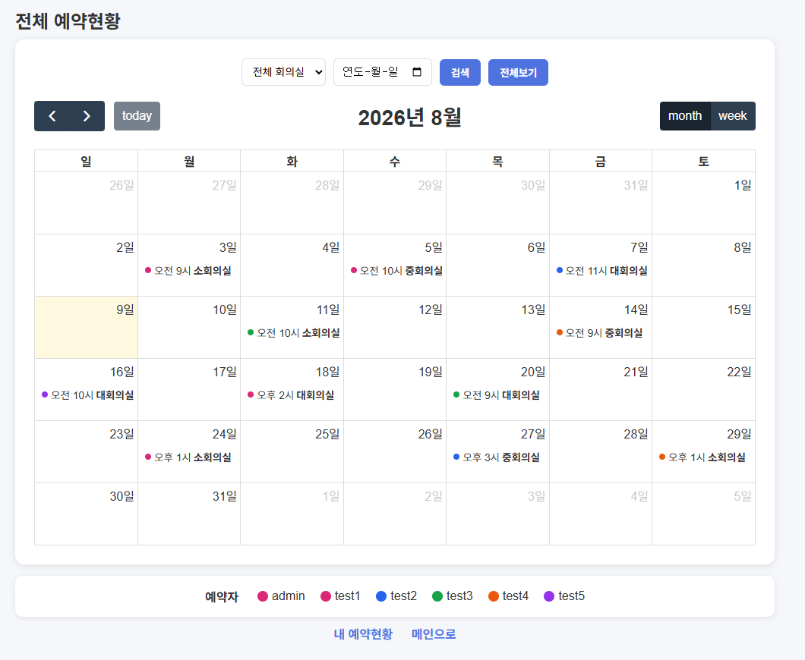
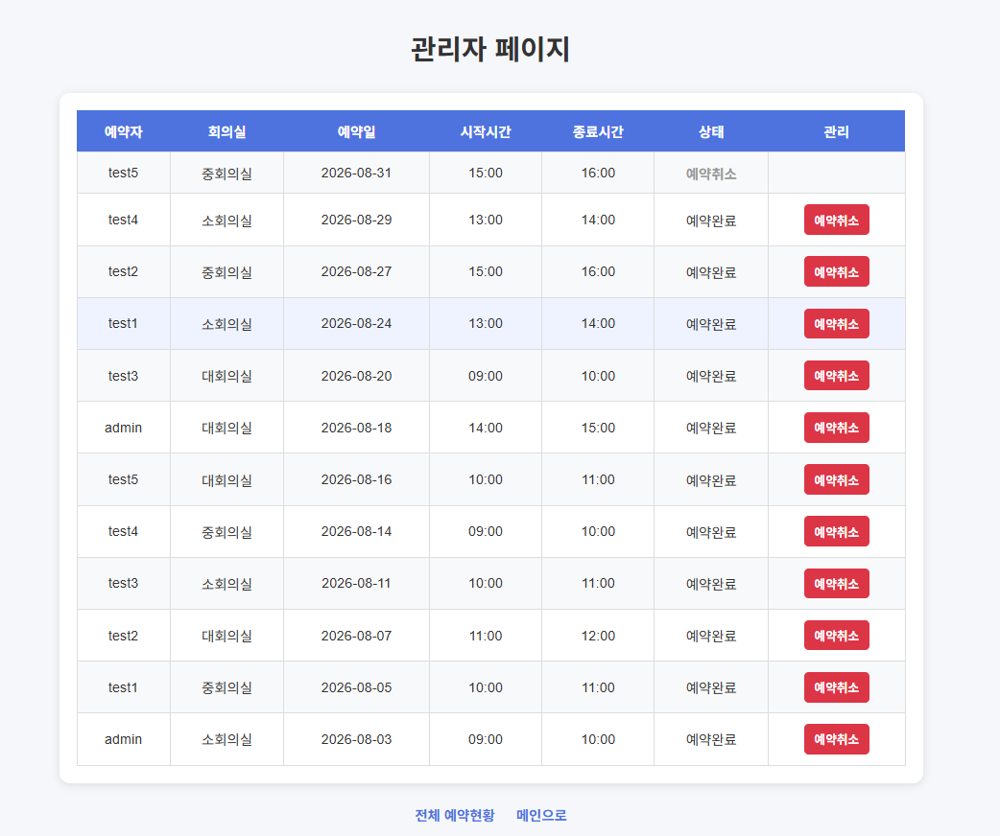

# 🏢 회의실 예약 시스템

> Spring Boot와 PostgreSQL을 활용한 웹 기반 회의실 예약 시스템

사용자가 회의실을 조회하고 원하는 날짜와 시간에 예약할 수 있으며,
예약 현황 조회, 예약 수정 및 취소, 전체 예약 캘린더, 관리자 예약 관리 기능을 제공하는 웹 서비스입니다.

---

## 📌 프로젝트 소개

### 개발 목적

회의실 예약 과정에서 발생할 수 있는 **예약 시간 중복 문제**와
전체 예약 현황을 확인하기 어려운 문제를 해결하는 것을 목표로 개발했습니다.

사용자는 로그인 후 회의실별 수용 인원과 예약 현황을 확인하고
원하는 날짜와 시간에 회의실을 예약할 수 있습니다.

예약 이후에도 자신의 예약을 조회하고 수정하거나 취소할 수 있으며,
전체 예약 현황은 캘린더 형태로 제공하여 날짜별 예약 상태를 한눈에 확인할 수 있도록 구현했습니다.

또한 `admin` 계정을 통해 전체 예약을 조회하고
관리자 권한으로 예약을 취소할 수 있도록 구현했습니다.

프로젝트 구현 후 코드 리뷰를 통해 발견된 보안 문제를 개선하여
예약 데이터 접근 권한 검증, 비밀번호 암호화, 세션 정보 최소화 등을 적용했습니다.

---

## ✨ 주요 특징

- 🔐 세션 기반 로그인 / 로그아웃
- 🔒 BCrypt 기반 비밀번호 암호화
- 🛡️ 예약 데이터 소유권 검증
- 🏢 회의실별 예약 관리
- ⏰ 예약 시간 중복 방지
- 📅 전체 예약 현황 캘린더
- 🎨 예약자별 캘린더 색상 구분
- ✏️ 예약 수정 및 취소
- 👨‍💼 관리자 예약 관리
- 💾 PostgreSQL 기반 데이터 관리
- 📱 직관적인 예약 화면 구성

---

## 🛠 Tech Stack

### Backend

| 기술 | 내용 |
|---|---|
| Java | 17 |
| Framework | Spring Boot 3.5.16 |
| SQL Mapper | MyBatis |
| Database | PostgreSQL |
| Password Security | Spring Security Crypto / BCrypt |

### Frontend

| 기술 | 내용 |
|---|---|
| Template Engine | Thymeleaf |
| Markup | HTML |
| Style | CSS |
| Script | JavaScript |
| Calendar | FullCalendar |

### Development

| 도구 | 내용 |
|---|---|
| IDE | IntelliJ IDEA |
| Build Tool | Gradle |
| Version Control | Git |
| Repository | GitHub |

---

## 🏗 프로젝트 구조

```text
Browser
   │
   ▼
Controller
   │
   ▼
Service
   │
   ▼
Mapper
   │
   ▼
PostgreSQL
```

각 계층의 역할을 분리하여 유지보수하기 쉽도록 구성했습니다.

- **Controller** : HTTP 요청 및 응답 처리
- **Service** : 예약 중복 검사 등 비즈니스 로직 처리
- **Mapper** : MyBatis를 이용한 SQL 처리
- **Domain** : 데이터 객체 관리
- **DTO** : 계층 간 데이터 전달 및 로그인 세션 정보 관리

---

# 📋 주요 기능

## 🔐 회원

- 로그인
- 로그아웃
- 세션을 이용한 로그인 상태 관리
- 로그인한 사용자별 예약 조회
- 로그인하지 않은 사용자의 예약 기능 접근 제한

로그인 성공 시 DB의 `Users` 객체 전체를 세션에 저장하지 않고,
비밀번호를 제외한 `LoginUser` DTO를 생성하여 세션에 저장합니다.

```text
Users
├── id
├── username
└── password
       ↓
    로그인 성공
       ↓
LoginUser
├── id
└── username
       ↓
    Session
```

이를 통해 세션에 불필요한 비밀번호 정보가 저장되지 않도록 구성했습니다.

---

## 🏢 회의실

- 회의실 목록 조회
- 회의실별 수용 인원 확인
- 회의실별 예약 현황 조회
- 회의실별 예약 화면 제공
- 회의실 이미지 제공

현재 등록된 회의실:

| 회의실 | 수용 인원 |
|---|---:|
| 소회의실 | 4명 |
| 중회의실 | 10명 |
| 대회의실 | 실제 등록값 기준 |
| 세미나실 | 실제 등록값 기준 |

---

## 📅 회의실 예약

사용자가 원하는 회의실과 날짜, 시간을 선택하여 예약할 수 있습니다.

예약 과정에서 다음과 같은 유효성 검사를 수행합니다.

- 오늘 이전 날짜 예약 방지
- 현재 시간 이전 예약 방지
- 시작시간 / 종료시간 유효성 검사
- 시작시간보다 종료시간이 빠른 경우 예약 방지
- 기존 예약과 시간 중복 여부 검사

---

## ⏰ 예약 시간 중복 검사

동일한 회의실에 이미 예약된 시간과 새로운 예약 시간이 겹치는 경우
예약을 차단합니다.

다음 조건을 이용하여 예약 시간의 겹침 여부를 검사합니다.

```text
기존 예약 시작시간 < 새로운 예약 종료시간
AND
기존 예약 종료시간 > 새로운 예약 시작시간
```

예를 들어 다음과 같은 경우 예약이 불가능합니다.

```text
기존 예약
10:00 ───────── 12:00

새로운 예약
       11:00 ───────── 13:00
```

반면 기존 예약이 끝나는 시간부터 새로운 예약을 시작하는 경우에는
예약할 수 있습니다.

```text
기존 예약
10:00 ───────── 12:00

새로운 예약
                  12:00 ───────── 13:00
```

---

## ✏️ 내 예약 현황

로그인한 사용자는 자신의 예약 내역을 확인할 수 있습니다.

- 내 예약 목록 조회
- 예약 날짜 및 시간 확인
- 예약 수정
- 예약 취소
- 예약 상태 확인

예약 취소 시 데이터를 실제로 삭제하지 않고
예약 상태를 `예약취소`로 변경하도록 구현했습니다.

```text
예약완료
   ↓
예약취소
```

이를 통해 취소된 예약의 상태도 데이터에서 확인할 수 있도록 구성했습니다.

---

## 📊 전체 예약 현황

FullCalendar를 이용하여 전체 사용자의 예약 현황을
캘린더 형태로 제공합니다.

- 월간 예약 조회
- 주간 예약 조회
- 날짜별 예약 표시
- 예약 정보 확인
- 예약자별 색상 구분
- 예약자별 색상 범례 제공

여러 사용자의 예약을 색상으로 구분하여
전체 예약 현황을 직관적으로 확인할 수 있도록 구현했습니다.

---

## 👨‍💼 관리자

`admin` 계정으로 로그인하면 관리자 페이지에 접근할 수 있습니다.

관리자는 전체 예약 내역을 확인하고 예약 상태를 관리할 수 있습니다.

### 관리자 기능

- 전체 예약 조회
- 예약자 확인
- 회의실 확인
- 예약 날짜 확인
- 예약 시간 확인
- 예약 상태 확인
- 관리자 권한으로 예약 취소

관리자 페이지 접근 시 Controller에서
로그인 여부와 관리자 계정 여부를 확인합니다.

현재 프로젝트에서는 별도의 `role` 컬럼을 사용하지 않고
`username`이 `admin`인 계정을 관리자 계정으로 구분하도록 구현했습니다.

---

# 🔒 보안 및 권한 처리

프로젝트 구현 후 코드 리뷰를 통해 발견된 보안 문제를 개선했습니다.

## 1. 예약 소유권 검증

예약 ID만 알고 있으면 다른 사용자의 예약을 수정하거나 취소할 수 있는 문제를 방지했습니다.

다음 기능에서 로그인한 사용자의 ID와 예약의 `userId`를 비교합니다.

```text
/reservation/update/{id}
/reservation/update
/reservation/cancel/{id}
```

권한 확인 과정:

```text
예약 요청
   ↓
로그인 여부 확인
   ↓
예약 조회
   ↓
관리자 여부 확인
   ↓
예약자 ID와 로그인 사용자 ID 비교
   ↓
권한이 있는 경우에만 수정 / 취소
```

일반 사용자는 자신의 예약만 수정 및 취소할 수 있으며,
`admin` 계정은 관리자 권한으로 전체 예약을 관리할 수 있습니다.

---

## 2. BCrypt 비밀번호 암호화

기존에는 비밀번호를 평문으로 저장하고 비교하는 방식이었습니다.

이를 개선하여 `BCryptPasswordEncoder`를 적용했습니다.

```text
사용자 입력 비밀번호
        ↓
BCryptPasswordEncoder
        ↓
DB의 암호화된 비밀번호와 비교
        ↓
로그인 성공 / 실패
```

로그인 시 단순 문자열 비교가 아닌:

```java
passwordEncoder.matches(
    inputPassword,
    encodedPassword
);
```

방식으로 검증합니다.

DB에도 비밀번호를 평문으로 저장하지 않고
BCrypt 해시값을 저장하도록 변경했습니다.

---

## 3. 세션 민감정보 최소화

기존에는 로그인 성공 시 `Users` 객체 전체를 세션에 저장하여
비밀번호 정보까지 세션에 포함될 수 있었습니다.

이를 개선하기 위해 `LoginUser` DTO를 생성했습니다.

```text
Users
├── id
├── username
└── password

        ↓

LoginUser
├── id
└── username
```

로그인 성공 후에는 `LoginUser` 객체만 세션에 저장하여
비밀번호가 세션에 포함되지 않도록 변경했습니다.

---

# 🗄 데이터베이스

## ERD

```text
┌──────────────┐
│    users     │
├──────────────┤
│ id (PK)      │
│ username     │
│ password     │
└──────┬───────┘
       │
       │ 1 : N
       │
       ▼
┌──────────────────┐
│   reservation    │
├──────────────────┤
│ id (PK)          │
│ room_id (FK)     │
│ user_id (FK)     │
│ reserve_date     │
│ start_time       │
│ end_time         │
│ status           │
└────────┬─────────┘
         │
         │ N : 1
         │
         ▼
┌──────────────┐
│    rooms     │
├──────────────┤
│ id (PK)      │
│ name         │
│ capacity     │
└──────────────┘
```

---

## 🗂 주요 테이블

### `users`

사용자 정보를 저장합니다.

| 컬럼 | 설명 |
|---|---|
| `id` | 사용자 번호 |
| `username` | 로그인 아이디 |
| `password` | BCrypt 암호화 비밀번호 |

---

### `rooms`

회의실 정보를 저장합니다.

| 컬럼 | 설명 |
|---|---|
| `id` | 회의실 번호 |
| `name` | 회의실 이름 |
| `capacity` | 수용 인원 |

---

### `reservation`

회의실 예약 정보를 저장합니다.

| 컬럼 | 설명 |
|---|---|
| `id` | 예약 번호 |
| `room_id` | 회의실 번호 |
| `user_id` | 예약자 번호 |
| `reserve_date` | 예약 날짜 |
| `start_time` | 시작 시간 |
| `end_time` | 종료 시간 |
| `status` | 예약 상태 |

예약 상태:

- `예약완료`
- `예약취소`

---

# 💡 주요 구현 포인트

## 1. 예약 중복 검사

예약 시간 구간 자체가 겹치는지 검사하여
동일한 회의실의 중복 예약을 방지했습니다.

```text
기존 시작시간 < 새로운 종료시간
AND
기존 종료시간 > 새로운 시작시간
```

---

## 2. 예약 수정 시 중복 검사

예약 수정 시 현재 수정 중인 예약까지 중복으로 판단하지 않도록
현재 예약 ID를 제외하고 중복 검사를 수행했습니다.

```sql
AND id != #{id}
```

---

## 3. 예약 취소 상태 관리

예약 취소 시 데이터를 실제로 삭제하는 대신
예약 상태를 변경하도록 구현했습니다.

```text
예약완료
   ↓
예약취소
```

이를 통해 취소된 예약도 데이터에서 확인할 수 있도록 구성했습니다.

---

## 4. 예외 발생 시 예약 화면 유지

예약 중복 등의 오류가 발생했을 때
단순히 오류 페이지만 표시하지 않고
사용자가 예약 화면에서 계속 작업할 수 있도록 처리했습니다.

오류 발생 시 다음 데이터를 다시 전달합니다.

- 회의실 정보
- 기존 예약 현황
- 오류 메시지

이를 통해 예약 실패 후에도 현재 회의실의 예약 상황을 바로 확인할 수 있도록 구현했습니다.

---

## 5. 세션 기반 로그인

`HttpSession`을 활용하여 로그인한 사용자의 정보를 저장하고
로그인 여부에 따라 기능 접근을 제한했습니다.

로그인 성공 후에는 비밀번호가 포함된 `Users` 객체 대신
`LoginUser` DTO를 세션에 저장합니다.

```text
로그인
  ↓
BCrypt 비밀번호 검증
  ↓
LoginUser 생성
  ↓
loginMember 세션 저장
  ↓
예약 기능 접근
```

---

## 6. 관리자 접근 제한

관리자 페이지 링크를 화면에서 숨기는 것뿐만 아니라
Controller에서도 관리자 여부를 확인하도록 구현했습니다.

```text
/admin 요청
    ↓
로그인 여부 확인
    ↓
username == admin 확인
    ↓
관리자 페이지 접근
```

일반 사용자가 `/admin` URL을 직접 입력하는 경우에도
관리자 페이지에 접근할 수 없도록 처리했습니다.

---

## 7. FullCalendar를 이용한 예약 시각화

DB에서 조회한 예약 정보를 FullCalendar 이벤트로 변환하여
캘린더에 표시했습니다.

예약자별로 서로 다른 색상을 적용하여
여러 사용자의 예약을 쉽게 구분할 수 있도록 구현했습니다.

또한 캘린더 하단에 예약자별 색상 범례를 제공하여
색상의 의미를 쉽게 확인할 수 있도록 구성했습니다.

---

# 🖥️ 화면

## 메인 화면

회의실별 이미지와 수용 인원을 확인하고
원하는 회의실을 선택할 수 있습니다.



---

## 회의실 예약

선택한 회의실의 예약 현황을 확인하고
날짜와 시간을 선택하여 예약할 수 있습니다.



---

## 예약 수정

기존 예약 정보를 확인하고
예약 날짜와 시간을 수정할 수 있습니다.



---

## 내 예약 현황

로그인한 사용자의 예약 내역을 확인하고
예약 수정 및 예약 취소를 수행할 수 있습니다.



---

## 전체 예약 현황

FullCalendar를 이용하여 전체 예약 현황을
월간 / 주간 캘린더 형태로 확인할 수 있습니다.

예약자별 색상을 적용하여
서로 다른 사용자의 예약을 쉽게 구분할 수 있도록 구현했습니다.



---

## 관리자 페이지

관리자 계정으로 로그인하면 전체 예약 내역을 확인할 수 있습니다.

관리자는 예약 상태를 확인하고
필요한 경우 예약을 취소할 수 있습니다.



---

# 📁 프로젝트 구조

```text
src
├─ main
│  ├─ java
│  │  └─ com.project.meetingroom
│  │     ├─ config
│  │     │  └─ PasswordConfig.java
│  │     │
│  │     ├─ controller
│  │     │  ├─ AdminController.java
│  │     │  ├─ HtmlController.java
│  │     │  └─ RoomsController.java
│  │     │
│  │     ├─ domain
│  │     │  ├─ Reservation.java
│  │     │  ├─ Rooms.java
│  │     │  └─ Users.java
│  │     │
│  │     ├─ dto
│  │     │  └─ LoginUser.java
│  │     │
│  │     ├─ mapper
│  │     │  ├─ ReservationMapper.java
│  │     │  ├─ RoomsMapper.java
│  │     │  └─ UsersMapper.java
│  │     │
│  │     ├─ service
│  │     │  ├─ ReservationService.java
│  │     │  ├─ RoomsService.java
│  │     │  └─ UserService.java
│  │     │
│  │     └─ MeetingroomApplication.java
│  │
│  └─ resources
│     ├─ mapper
│     │  ├─ reservation.xml
│     │  ├─ rooms.xml
│     │  └─ users.xml
│     │
│     ├─ static
│     │  └─ images
│     │
│     ├─ templates
│     │  ├─ index.html
│     │  ├─ login.html
│     │  ├─ rooms.html
│     │  ├─ reservations.html
│     │  ├─ myreservations.html
│     │  ├─ updateReservation.html
│     │  └─ admin.html
│     │
│     └─ application.yml
```

---

# 📚 개발을 통해 배운 점

## Spring Boot 계층 구조

Controller에서 모든 로직을 처리하지 않고 다음과 같이 역할을 분리했습니다.

```text
Controller
    ↓
Service
    ↓
Mapper
    ↓
Database
```

각 계층의 책임을 분리하면서
유지보수하기 쉬운 구조를 구성하는 방법을 학습했습니다.

---

## MyBatis

Mapper Interface와 XML을 분리하여 SQL을 관리하고
PostgreSQL 데이터베이스와 연동했습니다.

예약 시간 중복 검사와 예약 수정 시
현재 예약을 제외한 중복 검사 등을 구현하면서
SQL 조건을 활용한 데이터 검증 방법을 학습했습니다.

---

## Session

`HttpSession`을 활용하여 로그인한 사용자의 정보를 저장하고
로그인 여부에 따라 기능 접근을 제한했습니다.

또한 세션에 비밀번호가 저장되지 않도록
로그인 전용 `LoginUser` DTO를 분리하여 적용했습니다.

---

## BCrypt

비밀번호를 평문으로 저장하지 않고
BCrypt 방식으로 암호화하여 저장하는 방법을 학습했습니다.

로그인 시에는 암호화된 비밀번호를 직접 비교하지 않고
`PasswordEncoder.matches()`를 사용하여 검증하도록 구현했습니다.

---

## 권한 검증

예약 ID만으로 다른 사용자의 예약에 접근할 수 있는 문제를 확인하고
예약 수정 및 취소 시 로그인한 사용자와 예약 소유자를 비교하도록 개선했습니다.

이를 통해 단순히 화면에서 기능을 숨기는 것뿐만 아니라
Controller 단계에서도 실제 권한을 검증하는 방법을 학습했습니다.

---

## FullCalendar

DB에 저장된 예약 데이터를 FullCalendar 이벤트 데이터로 변환하여
캘린더 형태로 시각화했습니다.

예약자별 색상을 적용하여 여러 사용자의 예약을
직관적으로 구분할 수 있도록 구현했습니다.

---

# 🔐 보안 개선 과정

프로젝트 개발 이후 코드 리뷰를 통해 보안 관련 개선사항을 확인하고
다음과 같이 수정했습니다.

| 개선 항목 | 기존 | 개선 |
|---|---|---|
| 예약 권한 | 예약 ID만으로 접근 가능 | 예약 소유자 검증 |
| 비밀번호 | 평문 저장 및 비교 | BCrypt 암호화 |
| 세션 정보 | `Users` 전체 저장 | `LoginUser` DTO 저장 |
| 관리자 접근 | Controller에서 관리자 여부 확인 | 관리자 계정 접근 제한 |

단순히 기능을 구현하는 것에서 끝내지 않고
실제 서비스에서 발생할 수 있는 보안 문제를 확인하고 개선하는 경험을 했습니다.

---

# 🚀 배포

배포 예정

---

# 🔗 GitHub

GitHub Repository

---

# 🔮 향후 개선 사항

현재 구현된 기능을 기반으로 다음과 같은 기능을 추가할 수 있습니다.

- 회원가입 기능
- 회원가입 시 비밀번호 BCrypt 암호화 적용
- 관리자 회원 관리
- 관리자 회의실 등록 / 수정 / 삭제
- 예약 검색 및 필터 기능
- 관리자 대시보드
- 예약 통계 및 사용 현황 조회
- 예약 상세 정보 UI 개선
- 로그인 인증 및 접근 제어를 Interceptor 기반으로 공통화

---

# 👩🏻‍💻 개발자

## 하소이

Java와 Spring Boot를 기반으로 웹 개발 역량을 학습하며
직접 설계부터 구현까지 진행한 프로젝트입니다.

프로젝트를 통해 Spring Boot, MyBatis, PostgreSQL을 활용한
웹 애플리케이션 개발 경험을 쌓았으며,

예약 기능 구현뿐만 아니라 예약 중복 검증,
사용자 권한 검증, 비밀번호 암호화,
세션 민감정보 최소화 등 실제 서비스에서 고려해야 할
보안 요소까지 직접 개선했습니다.