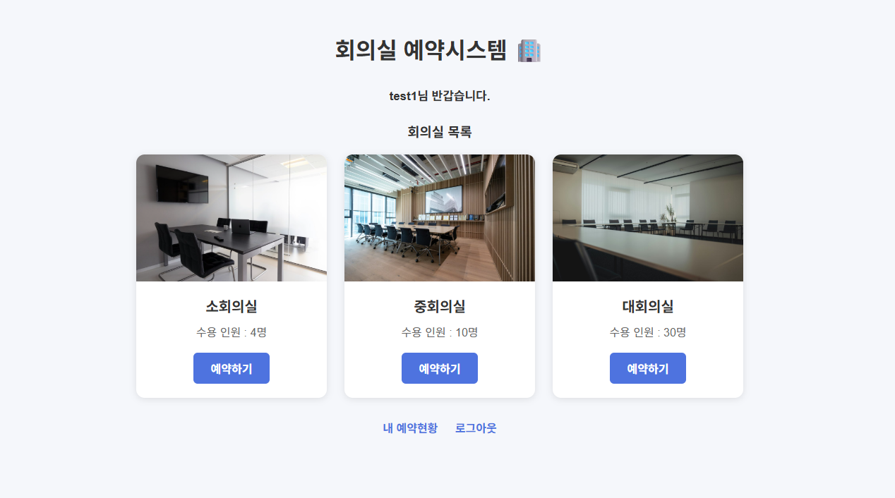
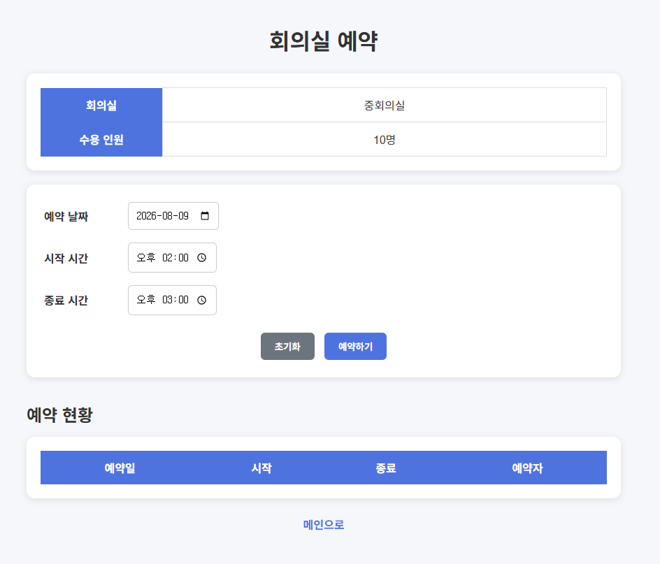
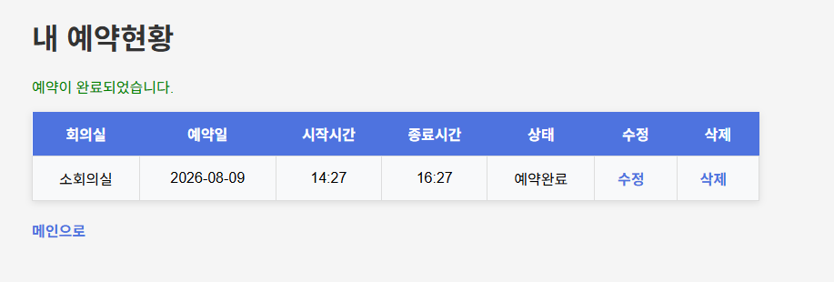
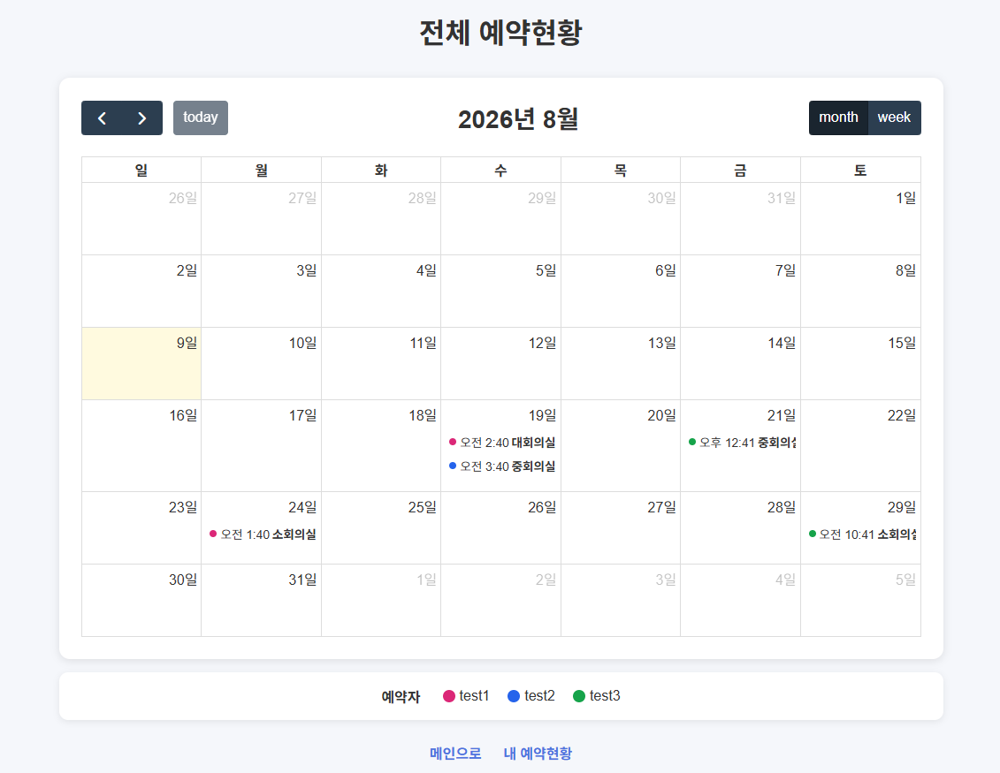

# 🏢 회의실 예약 시스템

Spring Boot와 PostgreSQL을 활용한 회의실 예약 웹 서비스입니다.

## 📌 프로젝트 소개

사용자가 회의실을 조회하고 원하는 날짜와 시간에 회의실을 예약할 수 있는
회의실 예약 시스템을 구현했습니다.

예약된 시간과 중복되는 예약을 방지하고,
사용자가 자신의 예약을 조회하고 수정 및 삭제할 수 있도록 구현했습니다.

## 🛠 사용 기술

### Backend
- Java 17
- Spring Boot
- MyBatis
- PostgreSQL

### Frontend
- HTML
- CSS
- JavaScript
- Thymeleaf

### 개발 환경
- IntelliJ IDEA
- Git / GitHub

## ✨ 주요 기능

### 회원
- 로그인 / 로그아웃
- 세션을 이용한 로그인 상태 관리

### 회의실
- 회의실 목록 조회
- 회의실별 수용 인원 확인
- 회의실별 예약 현황 조회

### 예약
- 회의실 예약
- 예약 시간 중복 검사
- 오늘 이전 날짜 예약 방지
- 현재 시간보다 이전 시간 예약 방지
- 시작시간 / 종료시간 유효성 검사

### 내 예약
- 내 예약 목록 조회
- 예약 수정
- 예약 삭제

## 🗄 데이터베이스

주요 테이블

- `users` : 사용자 정보
- `rooms` : 회의실 정보
- `reservation` : 회의실 예약 정보

## 📷 화면

### 메인 화면

### 회의실 예약

### 예약 수정

### 내 예약 현황

## 🚀 배포

### 전체 예약현황

배포 예정

## 🔗 GitHub

GitHub Repository

## 📝 개발 과정

회의실 예약 기능을 구현하면서 다음과 같은 기능을 직접 구현했습니다.

- Spring Boot Controller / Service / Mapper 구조 구현
- MyBatis를 이용한 SQL 연동
- PostgreSQL 데이터베이스 연동
- 예약 시간 중복 검사
- 세션 기반 로그인 처리
- Thymeleaf를 이용한 화면 구성
- JavaScript를 이용한 입력값 검증